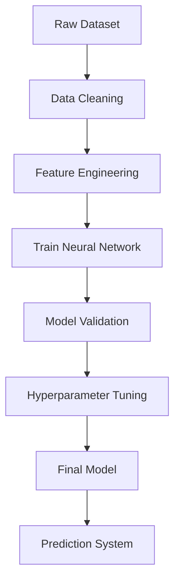
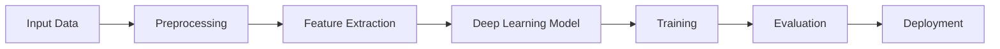

# 🔥 Project Badges


# 📌 Overview

This repository contains a **modular deep learning project scaffold** designed to help researchers and developers build scalable machine learning systems.

The project demonstrates a **complete deep learning workflow**, including:

* Data preprocessing
* Feature engineering
* Model building
* Training pipeline
* Evaluation
* Deployment-ready architecture

The scaffold allows developers to **experiment with deep learning models while maintaining clean project structure and reusable components**.

**PROJECT:**
**AI-Based Marine Species Detection and Behaviour Monitoring System**

**SIH HACKATHON PROBLEM STATEMENT 2025:**

Embedded Intelligent Microscopy System (SIH25042/SIH25043): Development of AI-powered systems to identify and count marine organisms for biodiversity assessment.

Marine Carbon Sink Monitoring(SIH25048): Research and tools to manage fish populations as a crucial component of the ocean carbon sink (blue carbon).

Environmental Impact Analysis(SIH250): Solutions to mitigate negative impacts on fish stocks from marine pollution, construction, and aquaculture.

**Marine Animals Multimodal Dataset**

A comprehensive multimodal dataset combining audio recordings and images of 32 marine species.

**Dataset Summary**

Total samples: 24,911

Species: 32

Audio files: 1,357 unique recordings

Images: 581 (309 matched + 272 from iNaturalist)

**Features**

species (string): Species name

label (int32): Numeric label (0–31)

audio (Audio): Audio recording of the species

image (Image): Species image

image_index (int32): Image number for this species

total_images (int32): Total images for this species

source (string): "LLM-Vision-Marine-Animals" or "iNaturalist"


**Data Sources**

Audio: ardavey/marine_ocean_mammal_sound

Matched images: yeyimilk/LLM-Vision-Marine-Animals

Additional images: Downloaded from iNaturalist API with research-grade observations and CC-compatible licenses.

CLASS_NAMES = [ 'Atlantic_Spotted_Dolphin', 'Bearded_Seal', 'Beluga', 'Blue_Whale', 'Bowhead_Whale', 'Common_Dolphin', 'Dugong', 'Fin_Whale', 'Gray_Seal', 'Gray_Whale', 'Harbor_Porpoise', 'Harbor_Seal', 'Harp_Seal', 'Hooded_Seal', 'Humpback_Whale', 'Killer_Whale', 'Leopard_Seal', 'Minke_Whale', 'Narwhal', 'North_Atlantic_Right_Whale', 'Northern_Elephant_Seal', 'Pacific_White_Sided_Dolphin', 'Pantropical_Spotted_Dolphin', 'Pilot_Whale', 'Ribbon_Seal', 'Ringed_Seal', 'Ross_Seal', 'Southern_Elephant_Seal', 'Sperm_Whale', 'Spinner_Dolphin', 'Spotted_Seal', 'Weddell_Seal' ]


**MODELS TRAINED:**


# 🎯 Objectives

The goal of this project is to:

* Provide a **clean deep learning pipeline**
* Enable **rapid experimentation with models**
* Demonstrate **best practices for ML project structure**
* Support **deep learning frameworks like TensorFlow and PyTorch**
* Enable **future MLOps integration**


# 🧠 Deep Learning Workflow




# 🖼 Model Pipeline Visualization


# 🧠 MLP Architecture Diagram


# 🧠 CNN Architecture Diagram


# 🧠 Pretrained CNN Architecture Diagram


# 🧠 RNN Architecture Diagram


# 🧠 LSTM Architecture Diagram


# 🧠 GRU Architecture Diagram


# 🧠 GAN Architecture Diagram


# 🧠 AE Architecture Diagram


# 📊 Model Performance

| Model          | Purpose                  | Performance             |
| -------------- | ------------------------ | ----------------------- |
| MLP            | Classification           | 79.66%                  |
| CNN            | Image Classification     | 93.94%                  |
| Pretrained CNN | Transfer Learning        | 98.72%                  |
| RNN            | Sequence Learning        | 85.75%                  |
| LSTM           | Temporal Modeling        | 92.96%                  |
| GRU            | Efficient Sequence Model | 94.38%                  |
| GAN            | Image Generation         | Qualitative (visual)    |
| Autoencoder    | Reconstruction           | Low reconstruction loss |


# 📂 Project Structure

```
Deep-learning_scaffolded-project
│
├── data
│   ├── raw
│   └── processed
│
├── notebooks
│   └── experiments.ipynb
│
├── src
│   ├── data_preprocessing.py
│   ├── model.py
│   ├── train.py
│   ├── evaluate.py
│
├── models
│   └── trained_models
│
├── requirements.txt
├── README.md
└── main.py
```


# ⚙️ Installation

### Clone Repository

```bash
git clone https://github.com/yehaa2004/Deep-learning_scaffolded-project.git
```


### Install Dependencies

```bash
pip install -r requirements.txt
```


### Run Training

```bash
python main.py
```


# 🚀 Example Usage

```python
from src.model import build_model
from src.train import train_model

model = build_model()

train_model(model)
```


# 🛠 Technologies Used

| Technology   | Purpose              |
| ------------ | -------------------- |
| Python       | Programming language |
| TensorFlow   | Deep learning        |
| PyTorch      | Neural networks      |
| Scikit-learn | ML utilities         |
| Pandas       | Data processing      |
| NumPy        | Numerical computing  |
| Matplotlib   | Visualization        |


# 🔬 Future Improvements

Future enhancements may include:

* Vision Transformers
* Model explainability (SHAP / LIME)
* Distributed training
* Docker deployment
* REST API serving
* MLOps pipelines


# 📚 References

* TensorFlow Documentation
* PyTorch Deep Learning Guide
* Neural Network Architecture Research Papers


# 👨‍💻 Author

**Yehaasary KM**

**CB.SC.P2AIE25032**

GitHub
[https://github.com/yehaa2004](https://github.com/yehaa2004)


