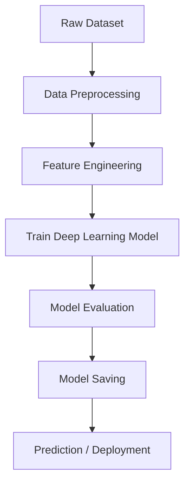

# 🧠 Deep Learning Scaffolded Project


## 📌 Overview

This repository contains a **scaffolded deep learning project structure** designed to build, train, and evaluate machine learning models efficiently.

The project demonstrates how to organize a **deep learning workflow including data preprocessing, model building, training, evaluation, and deployment**.

Deep learning models learn hierarchical features from data using multiple neural network layers, enabling them to solve complex tasks such as **image recognition, NLP, and predictive analytics**. ([DSpace MIT][1])

This scaffold helps developers and researchers quickly start building **deep learning pipelines with proper structure and modular design**.


# 🎯 Project Objectives

The goal of this project is to:

* Provide a **clean deep learning project structure**
* Implement **reusable training pipelines**
* Demonstrate **data preprocessing workflows**
* Enable **model experimentation**
* Improve **code organization for ML research**


# 📂 Project Structure

```text
Deep-learning_scaffolded-project
│
├── data/
│   ├── raw
│   ├── processed
│
├── notebooks/
│   └── experiments.ipynb
│
├── src/
│   ├── data_preprocessing.py
│   ├── model.py
│   ├── train.py
│   ├── evaluate.py
│
├── models/
│   └── saved_models
│
├── requirements.txt
├── README.md
└── main.py
```

This structure helps maintain **clean and scalable machine learning workflows**.


# ⚙️ System Architecture




# 🧠 Deep Learning Workflow

## 1️⃣ Data Collection

The dataset is collected and stored in the **data/raw** directory.

Example data types:

* Images
* Text
* Tabular datasets


## 2️⃣ Data Preprocessing

Preprocessing includes:

* Missing value handling
* Data normalization
* Tokenization (for NLP)
* Image resizing (for CV)

Libraries used:

* Pandas
* NumPy
* Scikit-learn


## 3️⃣ Feature Engineering

Feature extraction methods include:

* TF-IDF (NLP tasks)
* Embeddings
* Normalization


## 4️⃣ Model Building

Deep learning models may include:

### Neural Networks

* Dense Neural Networks
* CNN
* RNN / LSTM

Frameworks used:

* TensorFlow
* PyTorch

Deep neural networks can automatically extract high-level features from large datasets and improve predictive performance. ([Frontiers][2])


# 🧪 Model Training

Typical training pipeline:

```python
model.fit(
    X_train,
    y_train,
    validation_data=(X_test,y_test),
    epochs=20,
    batch_size=32
)
```

Training includes:

* Hyperparameter tuning
* Validation monitoring
* Loss optimization


# 📊 Model Evaluation

Evaluation metrics may include:

| Metric    | Purpose                         |
| --------- | ------------------------------- |
| Accuracy  | Classification correctness      |
| Precision | Spam / fraud detection accuracy |
| Recall    | Detection sensitivity           |
| F1 Score  | Balanced performance            |


# 💻 Installation

### 1️⃣ Clone Repository

```bash
git clone https://github.com/yehaa2004/Deep-learning_scaffolded-project.git
```


### 2️⃣ Install Dependencies

```bash
pip install -r requirements.txt
```


### 3️⃣ Run Training

```bash
python main.py
```


# 🚀 Example Workflow

```python
from src.model import build_model
from src.train import train_model

model = build_model()
train_model(model)
```


# 📈 Future Improvements

Possible enhancements include:

* Transformer architectures
* Model explainability (SHAP / LIME)
* Distributed training
* MLOps pipelines
* Docker deployment
* REST API integration


# 🔐 Applications

This scaffold can be used for:

* Fraud detection
* NLP classification
* Image recognition
* Recommendation systems
* Predictive analytics


# 🛠 Technologies Used

| Technology   | Purpose                 |
| ------------ | ----------------------- |
| Python       | Programming language    |
| TensorFlow   | Deep learning framework |
| PyTorch      | Neural network training |
| Scikit-Learn | Data preprocessing      |
| Pandas       | Data manipulation       |
| NumPy        | Numerical computing     |


# 📚 References

* Deep Learning Practicum – MIT
* Neural Network Architecture Research
* TensorFlow & PyTorch Documentation


# 👨‍💻 Author

**Yehaa**

GitHub:
[https://github.com/yehaa2004](https://github.com/yehaa2004)


[1]: https://dspace.mit.edu/bitstream/handle/1721.1/137526.2/137.pdf?isAllowed=y&sequence=4&utm_source=chatgpt.com "A DEEP LEARNING PRACTICUM: CONCEPTS AND ..."
[2]: https://www.frontiersin.org/journals/pharmacology/articles/10.3389/fphar.2025.1498662/full?utm_source=chatgpt.com "Protein structure prediction via deep learning: an in-depth ..."
