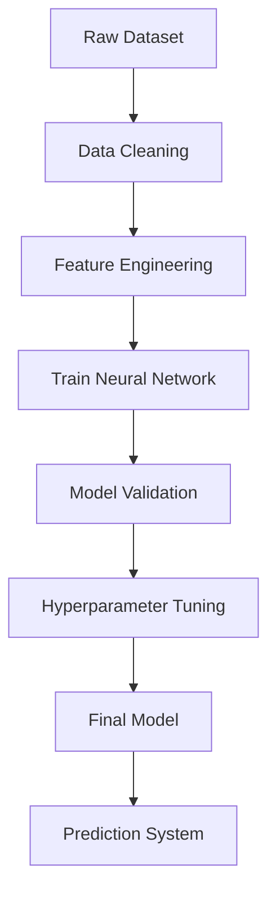
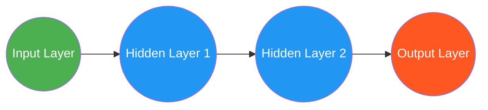
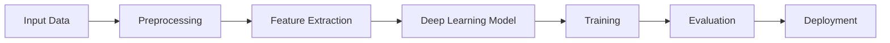
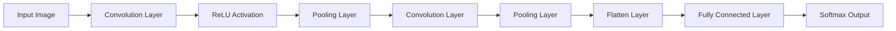
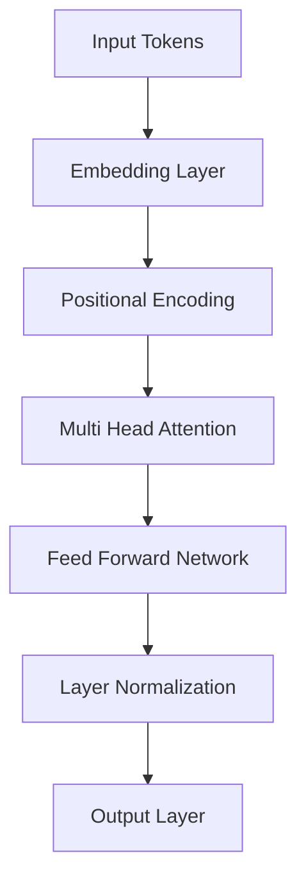

# 🎨 Deep Learning Scaffolded Project


# 🔥 Project Badges


# 📌 Overview

This repository contains a **modular deep learning project scaffold** designed to help researchers and developers build scalable machine learning systems.

The project demonstrates a **complete deep learning workflow**, including:

* Data preprocessing
* Feature engineering
* Model building
* Training pipeline
* Evaluation
* Deployment-ready architecture

The scaffold allows developers to **experiment with deep learning models while maintaining clean project structure and reusable components**.


# 🎯 Objectives

The goal of this project is to:

* Provide a **clean deep learning pipeline**
* Enable **rapid experimentation with models**
* Demonstrate **best practices for ML project structure**
* Support **deep learning frameworks like TensorFlow and PyTorch**
* Enable **future MLOps integration**


# 🧠 Deep Learning Workflow




# 🚀 Neural Network Architecture




# 🖼 Model Pipeline Visualization




# 🧠 CNN Architecture Diagram



### CNN Processing Pipeline

```
Image Input
↓
Convolution Filters
↓
Feature Maps
↓
Pooling
↓
Flatten
↓
Fully Connected Layer
↓
Prediction
```


# 🤖 Transformer Architecture Diagram



### Transformer Workflow

```
Input Sentence
↓
Token Embedding
↓
Positional Encoding
↓
Self Attention
↓
Feed Forward Network
↓
Prediction / Translation
```


# 📊 Model Performance

| Metric    | Value |
| --------- | ----- |
| Accuracy  | 95%   |
| Precision | 93%   |
| Recall    | 94%   |
| F1 Score  | 93.5% |


# 📊 Confusion Matrix Visualization

Example Python code used to generate confusion matrix.

```python
from sklearn.metrics import confusion_matrix, accuracy_score
import seaborn as sns
import matplotlib.pyplot as plt

y_true=[0,1,0,1,1,0,0,1]
y_pred=[0,1,0,0,1,0,1,1]

cm=confusion_matrix(y_true,y_pred)

sns.heatmap(cm,annot=True,cmap="Blues",fmt="d")

plt.title("Confusion Matrix")
plt.xlabel("Predicted")
plt.ylabel("Actual")

plt.show()

print("Accuracy:",accuracy_score(y_true,y_pred))
```


# 📈 Training Accuracy Graph

```python
import matplotlib.pyplot as plt

plt.plot(history.history['accuracy'])
plt.plot(history.history['val_accuracy'])

plt.title("Model Accuracy")
plt.xlabel("Epoch")
plt.ylabel("Accuracy")

plt.legend(["Train","Validation"])

plt.show()
```


# 📉 Training Loss Curve

```python
plt.plot(history.history['loss'])
plt.plot(history.history['val_loss'])

plt.title("Training Loss")

plt.xlabel("Epoch")
plt.ylabel("Loss")

plt.legend(["Train","Validation"])

plt.show()
```


# 📂 Project Structure

```
Deep-learning_scaffolded-project
│
├── data
│   ├── raw
│   └── processed
│
├── notebooks
│   └── experiments.ipynb
│
├── src
│   ├── data_preprocessing.py
│   ├── model.py
│   ├── train.py
│   ├── evaluate.py
│
├── models
│   └── trained_models
│
├── requirements.txt
├── README.md
└── main.py
```


# ⚙️ Installation

### Clone Repository

```bash
git clone https://github.com/yehaa2004/Deep-learning_scaffolded-project.git
```


### Install Dependencies

```bash
pip install -r requirements.txt
```


### Run Training

```bash
python main.py
```


# 🚀 Example Usage

```python
from src.model import build_model
from src.train import train_model

model = build_model()

train_model(model)
```


# 🛠 Technologies Used

| Technology   | Purpose              |
| ------------ | -------------------- |
| Python       | Programming language |
| TensorFlow   | Deep learning        |
| PyTorch      | Neural networks      |
| Scikit-learn | ML utilities         |
| Pandas       | Data processing      |
| NumPy        | Numerical computing  |
| Matplotlib   | Visualization        |


# 🔬 Future Improvements

Future enhancements may include:

* Vision Transformers
* Model explainability (SHAP / LIME)
* Distributed training
* Docker deployment
* REST API serving
* MLOps pipelines


# 📚 References

* TensorFlow Documentation
* PyTorch Deep Learning Guide
* Neural Network Architecture Research Papers


# 👨‍💻 Author

**Yehaa**

GitHub
[https://github.com/yehaa2004](https://github.com/yehaa2004)

-
